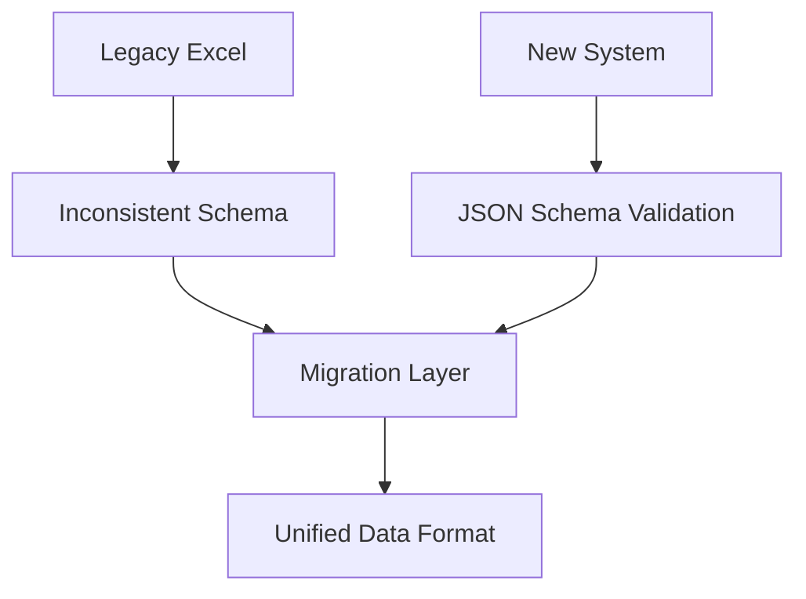

## What is Project Catalyst exactly and how to make it more Data-Driven
[Project Catalyst](https://projectcatalyst.io/)

*This project invites community participation and contribution. Contact us to become a contributor on Github or send us your feedback and ideas.*

According to the Project Catalyst [Knowledge Base](https://docs.projectcatalyst.io/) "Project Catalyst is the world’s largest decentralized innovation engine for solving real-world challenges.Project Catalyst is the world’s largest decentralized innovation engine for solving real-world challenges." It has produced hundreds of decentralized addition to its own ecosystem and contributed massively to the growth of Cardano tooling, dApps and use cases. Community-sponsored initiatives proliferate and now probably the single best source for information about past funds and proposals is no longer top-down but provided by [Lido Nation's Catalyst Explorer](https://www.lidonation.com/en/catalyst-explorer/) which will be an important source for any data-driven project in addition to the IdeaScale platform, Catalyst's own website and governance data sharing like Google Drive. 

### Iteration and The Experiment


The initiative to distribute Treasury grants in a decentralized manner with community voting and oversight calls itself *The Experiment* and the mantra that *things may break or lack documentation* is repeated by a community member at every weekly [Town Hall](https://www.youtube.com/playlist?list=PLnPTB0CuBOByRhpTUdALq4J89m_h7QqLk).

### Decentralized Governance
This section looks at how community roles past, present and future shape Project Catalyst and how quantitative tools can make their work easier and inform improvements in the process.

### Liquid Democracy and dReps
With the advent of the [Voltaire era](https://roadmap.cardano.org/en/voltaire/) ADA holders will be able to delegate their voting power to Catalyst dReps. This is likely to increase voting participation and proposal scrutiny - can past fund rule changes predict those changes?

### Community Reviewer and Proposal Scores
Review scores' influence of voting outcomes has changed dramatically across past funds - can we visualize and explain this?

### Funding and Voting
Relationships between funding requested, funding available and voter response are important to understand decentralized allocation of Treasury capital.

### Performance and Milestones
AI and quantitative analysis of the milestones module could greatly facilitate measuring KPIs like reviewer response times, check for duplicate or plagiarized evidence or search for proposals that contribute to open source collaboration or essential libraries.

### Abuse and Policing
Level 2 [Reviewers](https://docs.projectcatalyst.io/current-fund-basics/community-review-guidelines-fund12/community-reviewer-levels) currently use common sense and their experience to filter out profanity, use of AI and substandard reviews - but could AI or data science help them do a better job?

How do we use data to spot irregularity in proposal submission, review and voting?

As believers in "code as law" can we hard code fund rules and simulate or test automatic enforcement?


### Transition to In-House Stack (Catalyst Voices & Hermes)

*In Fund10, the Cardano community gave consent for the Catalyst Team to begin realizing a technical roadmap that advances the state of the art for the innovation funding platform offered by Project Catalyst.*

*The goal of Catalyst Systems Improvements: Discovery category is to explore new strategic requirements or test technical or procedural experiments for Catalyst which have not yet demonstrated that high degrees of validation has already been achieved.*

*By following a data-driven approach to design and testing that benefits Project Catalyst, outputs achieved from this category will develop a shared understanding among the Cardano community about which priorities should be developed to service the broader innovation ecosystem building on Cardano.*  

This consists of two community-funded projects carried out by the team currently running Catalyst for IOG and the Cardano Treasury. The first part, replacing the old structure of IdeaScale and a plethora of Excel spreadsheets and Google drive shares with an in-house voting centre and liquid democracy platform called [Catalyst Voices](https://projectcatalyst.io/funds/10/catalyst-systems-improvements/iog-catalyst-team-ideascale-replacement-and-web-browser-based-voting-centre-with-liquid-democracy-aka-catalyst-voices) is highly relevant to this project. It is expected to complete by early 2025 and will need to be taken into consideration for compatibility of our tools with their future data formats and requirements. Their [Milestones](https://milestones.projectcatalyst.io/projects/1000096) are publicly accessible and they are part of the funded proposer cohort of Fund-10 and reporting accordingly. The second one is [Hermes Core](https://projectcatalyst.io/funds/10/catalyst-systems-improvements/iog-catalyst-team-catalyst-ecosystem-accelerator-hermes-core-architecture-development) with [Milestones](https://milestones.projectcatalyst.io/projects/1000095) equally transparent.

Our project will integrate their tooling and formats into our database and API extensions coming from Milestone 2 / July onwards (see Roadmap) but here is a summary of implications already identified:

Growing importance of on-chain data and ability to track currently opaque interactions like Google form submissions through [Hermes/Voices infra](https://youtu.be/44z4_GznyBc?si=dO5LnQakbWOIals6&t=1033)

From Milestone 4 onwards, November 2024, the data-relevant stack decisions are part of Milestone deliverables, and highly relevant. By then, our project will already have concluded so early involvement of the team in our "stakeholder inputs" and Workshop will be important and so will be keeping our own stack **flexible**, **open source** and **scalable**. Use of vectorization, C-integration, PostgreSQL database and other such measures have so far been discussed but need to be expanded on heavility until July - see Roadmap.

What we already know about the infrastructure development as it is taking shape and from the first two milestones is that on-chain data will be much richer and allow for data analysis of liquid democracy processes like delegation choices.


It will therefore be important to create our own API and database functionality to be able to read JSON format and make this useable with the Python packages that often already have ways to process this kind of metadata very efficiently.


*These parts of their acceptance criteria are the earliest really pertinent ones for data-driven stack:*
**Update Catalyst Database Schema to Support Proposal Submission**
* Add Proposal Definition data per Fund Challenge or Category.
* An Event will be able to define the format of the Proposals which can be placed on the Events Objective.
* Each Challenge or Category will be able to support a different Proposal Format.
* Proposal Format will be defined by JSON Schema to enable easy Proposal validation, reuse and Front End integration.
* Enhance individual Proposal Data to allow us to store proposals submitted from catalyst voices.
* Proposals need to be in at least a Private and Published state, as well as Draft and Final.
* Draft Proposals will be stored as time sorted revisions, so that older proposal versions can be retrieved by the proposal author/s to enhance editing experience.
* Add to the DB schema to allow the storage of comments on proposals which must be signed by a voter or representative making the comment.
* Comments need to be time ordered.
* Comments can be deleted, but they are only marked as deleted in the backend until the end of the Fund which allows a Commenter to undelete their comment if desired.

Early development outputs are available on Github.

**Catalyst Voices**

Clone this repository:

~~~
git clone https://github.com/input-output-hk/catalyst-voices.git
cd catalyst-voices
~~~

Navigate to individual project folders and follow their respective setup instructions.


***Hermes Core***

Most of the infrastructure elements of Hermes Core exceed the scope of our project. *The Catalyst team has more than 20 core contributors, mostly full-time employees, who benefit from sharing resources across IOG, allowing the Catalyst team to dynamically increase or scale back its resource capacity when needed to leverage UI/UX design research, full-stack development, technical and cryptographic research, and product marketing as required.* Having said that, liquid democracy and on-chain governance are going to be crucially important to discussions about opportunities and risks from [AI](https://github.com/Sapient-Predictive-Analytics/Data-Driven_Catalyst/blob/main/Using_AI.md) for decentralized ecosystems.

Infrastructure is currently not available as testnet etc but Milestone code will be published and evolve in the public domain on Github:

Clone this repository:
~~~
git clone https://github.com/input-output-hk/hermes.git
cd hermes
~~~

`Install global dependencies:`
coming soon

[Navigate to individual project folders and follow their respective setup instructions.](https://github.com/input-output-hk/hermes/tree/main/hermes#build-notes)


`Overview of Cardano Transaction processing and the data this may generate for posterity / analysis.`


**[Discovery](https://cardano.ideascale.com/c/campaigns/409/about)**

* Areas of interest:

*Architectural design research for engineering of decentralization and/or distribution of decision-making advances for the Catalyst Voting System
Research that clearly defines a known Catalyst-specific problem-space where the intention is to identify facts and/or clearly stated opinions that will likely assist in producing novel, Catalyst-specific technical requirements.*
*Detailed studies of a Catalyst-specific subject, especially in order to discover (new) information or reach a (new) understanding for the benefit of servicing the broader innovation community building on Cardano.*

# Catalyst Voices and Hermes Core Compatibility Report for Data-Driven Catalyst

Data-Driven Catalyst tools, database and API were created with transition to Catalyst Voices and Hermes Core in mind. Comparing legacy funds that only had Excel spreadsheets as outputs with sophisticated on-chain liquid democracy and (initially) the Flutter-framework of Catalyst Voices had to be considered. This posed a lot less problems than we initially imagined, as the open source libraries we use have more problems with exported formulas and validation cells in the legacy format than any streamlined in-house solution we expect following the Milestones and feedback from the Catalyst team. We used CSV, JSON and plain text formats and a MongoDB Atlas database to make it as easy as possible to gather and clean Fund7 to Fund12 data. In the future, rather less cleaning will be required as human aggregation will give way to automated processes and mainnet or side-chain queries.

Below, we anticipate the straight-forward integration of our existing infrastructure, should the need arise, or indeed any contributing community member who is using [legacy data](https://projectcatalyst.io/), CSV files from this repo, or Atlas MongoDB and comparable NoSQL data storage and retrieval for this purpose.

### List of known Issues

(1) USD-ADA regime. Prior to Fund-10, funding amounts were in USD and transitioned to the ADA economy. This should be reflected with ADA/USD during the proposal drafting stage for each fund.
(2) Changes in Column Names - easy data cleaning task
(3) Changes in Community Reviewer scoring categories - usually mitigated by using average score across.
(4) Validation worksheets - to be removed
(5) Hyperlinks - legacy URLs not working, refer to Lido Explorer or offline resources
(6) Special characters and emoticons - encoding or removal options used in Pandas (see scripts in Code folder)
(7) Duplicate or In Reserve proposals - very few, require manual cleaning
(8) Incompatibility issues with XLS, XLSX, CSV or ODS formats: solved by openpyxl library
(9) Other useful data cleaning in the proposal body can be done with re, difflib, skrub and TextBlob
(10) Some legacy XLS files may cause bad column alignment if special characters are interpreted as tabs during import - do all cleaning prior to merging or importing this data!


# Data-Driven Catalyst: Legacy to Voices/Core Migration Guide


> A comprehensive guide for handling data compatibility between legacy Project Catalyst data and the new Voices/Core infrastructure

## 📋 Table of Contents

- [Overview](#overview)
- [Current Architecture](#current-architecture)
- [Compatibility Challenges](#compatibility-challenges)
- [Solutions](#solutions)
- [Integration Guide](#integration-guide)
- [Timeline](#timeline)
- [Contributing](#contributing)

## 🔍 Overview

This repository provides tools and guidance for managing the transition from legacy Excel-based Project Catalyst data to the new blockchain-based Catalyst Voices and Core infrastructure, scheduled for deployment in 2025.

## 🏗 Current Architecture

<details>
<summary>Legacy Data Sources</summary>

- Historical fund data in Excel
- CSV/JSON conversions
- MongoDB Atlas database
- Custom Python processing libraries

</details>

<details>
<summary>Future Infrastructure</summary>

- Catalyst Voices (Flutter web app)
- Catalyst Core (Hermes/Athena)
- Blockchain-based authentication
- Role-based access control

</details>

## ⚠️ Compatibility Challenges

### Data Structure Disparities



### Authentication Changes

- Legacy: Email-based
- Future: Blockchain wallet authentication
- Challenge: User identity mapping

## 🛠 Solutions

### Schema Transformation Layer

```python
class SchemaTransformer:
    """Transform legacy Catalyst data to new schema format."""
    
    def __init__(self):
        self.legacy_schemas = {}
        self.target_schema = {}
    
    def transform_proposal(self, legacy_proposal):
        """
        Convert legacy proposal to new format.
        
        Args:
            legacy_proposal (dict): Original proposal data
            
        Returns:
            dict: Transformed proposal matching new schema
        """
        transformed = {
            "proposal_id": legacy_proposal.get("id"),
            "title": legacy_proposal.get("title"),
            "category": self.map_category(legacy_proposal.get("challenge")),
            "author": self.map_author(legacy_proposal.get("proposer")),
            "content": self.standardize_content(legacy_proposal),
            "metadata": self.extract_metadata(legacy_proposal)
        }
        return transformed
```

### Role Mapping System

```python
class RoleMapper:
    """Map legacy roles to new role-based system."""
    
    def __init__(self):
        self.legacy_roles = set(["proposer", "voter", "advisor"])
        self.new_roles = set(["proposer", "voter", "representative", "reviewer"])
    
    def map_legacy_role(self, old_role, user_id):
        """
        Create compatible role definition.
        
        Args:
            old_role (str): Original role name
            user_id (str): User identifier
            
        Returns:
            dict: Standardized role information
        """
        return {
            "role": self.standardize_role(old_role),
            "user_id": self.map_user_identity(user_id),
            "verification": "legacy",
            "metadata": self.generate_role_metadata(old_role, user_id)
        }
```

### Unified Data Connector

```python
class CatalystDataConnector:
    """Unified interface for accessing both legacy and new data."""
    
    def __init__(self):
        self.legacy_client = MongoClient()
        self.blockchain_client = CardanoClient()
        
    async def get_proposal_history(self, proposal_id):
        """
        Retrieve proposal data from either system.
        
        Args:
            proposal_id (str): Unique proposal identifier
            
        Returns:
            dict: Standardized proposal data
        """
        # Check legacy data first
        legacy_data = await self.legacy_client.get_proposal(proposal_id)
        if legacy_data:
            return self.transform_legacy_proposal(legacy_data)
            
        # Check new system
        blockchain_data = await self.blockchain_client.get_proposal(proposal_id)
        return blockchain_data
```

## 📊 Integration Guide

### Quick Start

1. Install required packages:
```bash
pip install data-driven-catalyst
```

2. Initialize the connector:
```python
from catalyst_data import CatalystDataConnector

connector = CatalystDataConnector()
```

3. Query proposal data:
```python
# Get proposal history
proposal = await connector.get_proposal_history("proposal-123")

# Get voter information
voter = await connector.get_voter_history("voter-456")
```

### Advanced Usage

<details>
<summary>Custom Transformations</summary>

```python
# Create custom transformer
transformer = SchemaTransformer()
transformer.add_custom_mapping(
    source_field="old_field",
    target_field="new_field",
    transform_func=lambda x: x.upper()
)
```

</details>

<details>
<summary>Batch Processing</summary>

```python
# Process multiple proposals
async def batch_transform(proposal_ids):
    results = []
    async for pid in proposal_ids:
        proposal = await connector.get_proposal_history(pid)
        results.append(proposal)
    return results
```

</details>

## 📅 Timeline

| Phase | Timeline | Description |
|-------|----------|-------------|
| Preparation | Q1 2025 | Data mapping, transformation tools |
| Implementation | Q2 2025 | Library updates, initial migration |
| Validation | Q3 2025 | Testing, optimization |
| Integration | Q4 2025 | Full rollout |

## 🤝 Contributing

Once we transition to Catalyst Voices (expected 2Q-2025) we anticipate renewed interest from Catalyst system improvements. In the spirit of open source and decentralized community, forks and contributions will be welcome. Below "getting started" are examples and can easily be created from the above code snippets, helper Python scripts and a dedicated Migrations folder in our main repository. Please read our [Contributing Guide](CONTRIBUTING.md) for details on our code of conduct and the process for submitting pull requests.

### Development Setup

1. Clone the repository:
```bash
git clone https://github.com/data-driven-catalyst/migration-tools.git
```

2. Install development dependencies:
```bash
pip install -r requirements-dev.txt
```

3. Run tests:
```bash
pytest tests/
```

## 📝 License

This project is licensed under the MIT License - see the [LICENSE](LICENSE) file for details.

## 🙏 Acknowledgments

- Project Catalyst Team
- LIDO Nation / LIDO Explorer
- Community Contributors

---

<div align="center">
Made with ❤️ for the Cardano community
</div>
