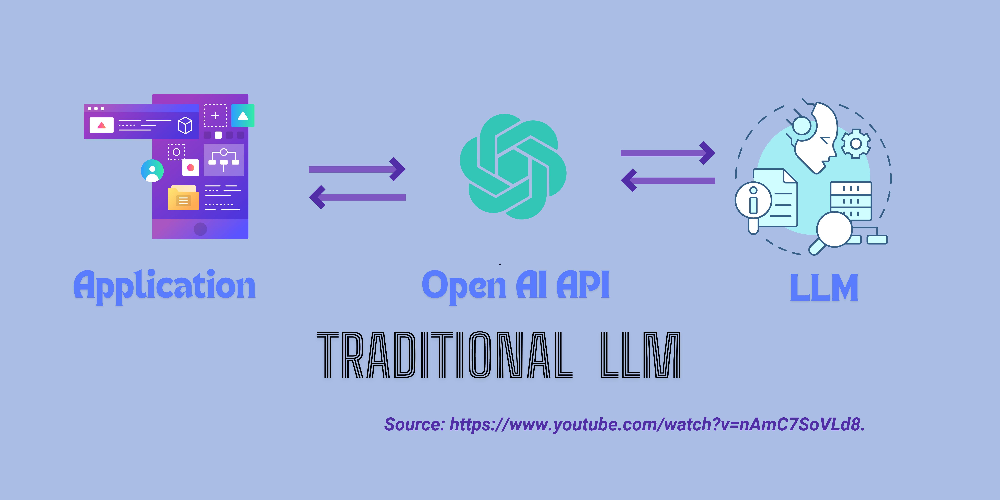

### What are Large Language Models? How could they benefit Project Catalyst?

Using a Large Language Model (LLM) like now-famous ChatGPT or ideally a home-grown or open source one could significantly enhance the operations and outcomes of Project Catalyst, especially in terms of improving between iterations and strengthening oversight and governance. In this section we are looking at some potential benefits and applications, give background, introduce open source and paid LLMs, and discuss limitations and risks.

#### Potential Areas of Interest

**Proposal Review and Scoring Assistance**

Quality Control: LLMs can assist community reviewers by pre-evaluating proposals for clarity, completeness, and coherence, ensuring that reviewers focus on the most promising submissions.

Consistency: AI can help maintain scoring consistency by providing baseline evaluations or suggested scores based on historical data and predefined criteria, reducing subjectivity and variability in human reviews.

Feedback Generation:
Constructive Feedback: LLMs can generate detailed, constructive feedback for proposers, helping them understand the strengths and weaknesses of their proposals and suggesting improvements.

Iterative Learning: By analyzing feedback from previous funds, the AI can guide proposers on common pitfalls and success factors, improving the overall quality of submissions over time.

**Enhanced Decision-Making**

Data-Driven Insights: By aggregating and analyzing voting patterns, reviewer comments, and proposal outcomes, an LLM can provide insights into the decision-making process, identifying trends and biases that might not be evident to humans.
Predictive Analytics: AI can predict the potential impact and feasibility of proposals based on similar past projects, helping voters and reviewers make more informed decisions.

Governance and Oversight:
Transparency: An LLM can automatically generate reports and summaries of fund activities, including proposal statuses, fund allocations, and voting outcomes, increasing transparency and accountability.

Policy Recommendations: By analyzing outcomes and community feedback, the AI can suggest changes to governance policies or operational procedures to improve efficiency and fairness in future funds.

Community Engagement and Education:
Personalized Support: AI can provide tailored support to community members based on their interaction history, improving user experience and engagement.
Education and Training: The LLM can create educational content and training modules to help community members understand the blockchain technology, the funding process, and best practices for proposal creation and evaluation.

Automation of Repetitive Tasks:
Administrative Efficiency: Routine tasks such as eligibility checks, progress tracking, and compliance monitoring can be automated using AI, freeing up human resources for more strategic activities.

Enhancing Scalability:
Handling Scale: As Project Catalyst grows, AI can help manage the increasing volume of proposals and reviews without compromising the quality of the evaluation process.

Risk Management:
Anomaly Detection: AI systems can be trained to detect anomalies or unusual patterns in proposal submissions or voting behavior, which could indicate errors or fraudulent activities.

By integrating an LLM into its operations, Project Catalyst can leverage these capabilities to continuously refine its processes and adapt to new challenges, ultimately making the decentralized innovation engine more effective and responsive to the needs of its community.
***

## Open-Source LLMs

If you want to train, fine-tune, or run a LLM on your own, there are a number of models available, ranging from older models from major AI companies to non-commercial research models, to some more recent, permissively licensed models.

**1. [Google BERT](https://github.com/google-research/bert)**
One of the first openly available transformer-based LLMs and available under the permissive Apache 2.0 license.
BERT is the foundation for many of the tools for scientific applications of LLMs.

**2. [OpenAI GPT-2](https://github.com/openai/gpt-2)**
OpenAI’s 2nd generation LLM, released under a permissive MIT license. GPT-2 is now 4 years old, so well-behind the
state-of-the-art, but ground-breaking at the time.

**3. [BLOOM](https://bigscience.huggingface.co/blog/bloom)**
A multi-lingual LLM by a large consortium of researchers and organizations, including Hugging Face. It is opensourced under the Responsible AI License (usable commercially with some restrictions, particularly around
disclosure and medical use-cases). There is also BLOOMZ which is fine-tuned for following instructions rather than
conversation.

**4. [Falcon LLM](https://huggingface.co/tiiuae)**
An LLM released by the Technology Innovation Institute under a permissive Apache 2.0 license. This is used as a
basis for a number of other open tools, such as LAION’s Open Assistant (https://open-assistant.io/).

**5. [MPT-30B](https://mosaicml.com/blog/mpt-30b)**
A collection of LLMs with different optimizations trained inexpensively on very large input sets. Released by
MosaicML under the Apache 2.0 license with the intent that it is commercially usable.

**6. [Dolly/Pythia](https://huggingface.co/databricks/dolly-v2-12b)**
An LLM tuned by Databricks based on the Pythia LLM. It is not cutting edge but is large and released under an MIT
license.

**7. [Stanford University Alpaca](https://crfm.stanford.edu/2023/03/13/alpaca.html)**
A model based on Meta’s LLaMA v1 produced by the Center for Research on Foundation Models (CRFM) group at
Stanford. The model is open-sourced under a non-commercial license and designed to be trained inexpensively on
smaller data sets. There are a number of other models derived from this, such as Vicuna (lmsys.org/blog/2023-03-
30-vicuna).

**8. [LeRF](https://lerf.io)**
LeRF combines the ability to reconstruct a 3D scene from a handful of still images using Neural Radiance Fields
(NeRF) with LLMs, allowing easy searching of a 3D scene using natural language. The models and code are open
source but currently without a license, and so not yet commercially usable.
***

**Challenges faced by traditional LLM architecture**

Traditional large language models (LLMs) have several limitations. They often lack access to external data sources, so they can't retrieve or interact with up-to-date information, which limits their effectiveness for tasks requiring current data.

Traditional LLMs also don't support real-time data capabilities. They rely solely on pre-existing knowledge and cannot update or fetch new information on the fly, making them less useful in scenarios needing timely data.

Additionally, traditional LLMs can be expensive to deploy and maintain due to high infrastructure costs, making them less accessible for smaller organizations or individual developers.

LangChain overcomes these issues by integrating with various external data sources, enabling real-time data access, and offering a more cost-effective and flexible solution, making it a superior choice for advanced AI applications.

***

**Unleashing LangChain: recent development in Artificial Intelligence / LLM and their relevance to a data-driven Catalyst**

LangChain is a versatile, open-source framework that helps AI developers connect large language models (LLMs) with various external data sources, enables them to experiment and locate the right models.

- How it works >> Traditional LLMs can forget parts of long texts because they have limited memory. LangChain solves this by keeping track of the context during longer interactions. Earlier parts of the conversation can be pushed back into the model, so it gives more coherent and context-aware responses.
- LangChain’s modular approach allows you to dynamically compare different prompts and models with minimal code changes. This flexibility is great for applications using multiple LLMs, such as one model to interpret user queries and another to generate responses. It reduces the need for extensive coding, making it easier for both experts and beginners to experiment and prototype with generative AI.
- LangChain uses the MIT license, which is worth noting for its impact on development freedom. This permissive license lets developers use, modify, and distribute the software in their own projects, including commercial products, without any restrictions. However, you must include the original copyright notice and disclaimers. This openness encourages innovation and helps the technology spread across different industries
***

**LangChain's potential applications on Project Catalyst (risk/ limitation & opportunities)**

LLM can uncover insight when it applies to large database. The process for Catalyst project would be more transparent and voters can obtain insight about the projects more accurately. Not only the data retrieved from previous fund could be put into better use, the external data would also be utilized. This could lead to specific answers for some of the following important questions:

- Does Proposer complete their previous funding tasks up to fund 8 before proposing in fund 12?
- How much in total they have requested in the current funding round? Should there be a cap of budget imposed so that the fund could be allocated more efficiently?
- How much is the total fund requested by proposers?

Well known community tooling like LidoNation <https://www.lidonation.com/en/catalyst-explorer/proposals?fs%5B%5D=139&cs%5B%5D=141&bs%5B%5D=0&bs%5B%5D=6281500> has been a major tooling that community members/voters search for the above questions. However, its usage among newcomers is still little known as they are unaware of this very useful community tool as shown in the discussion among new funded proposer chat groups.

LangChain would be able to summarize multiple perspectives and diverse datasets and shed light on these questions. It preprocesses data to minimize bias, chooses training data sources thoughtfully, and maintains ongoing oversight to spot and fix any biases that arise. These measures help create fairer and more balanced AI outputs.
***

\*\*References:\*\*

[_https://builtin.com/articles/langchain#:~:text=LangChain%20helps%20AI%20developers%20integrate,well%2Dversed%20in%20the%20framework_](https://builtin.com/articles/langchain#:~:text=LangChain%20helps%20AI%20developers%20integrate,well%2Dversed%20in%20the%20framework)

[_https://medium.com/@charlesjsq/intoduction-to-langchain-a-powerful-framework-for-applications-with-llms-e327db7ac5f4_](https://medium.com/@charlesjsq/intoduction-to-langchain-a-powerful-framework-for-applications-with-llms-e327db7ac5f4)

[_https://medium.com/@johnidouglasmarangon/how-to-summarize-text-with-openai-and-langchain-e038fc922af_](https://medium.com/@johnidouglasmarangon/how-to-summarize-text-with-openai-and-langchain-e038fc922af)

